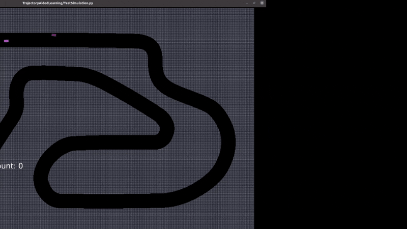

# MAI Thesis - Emran Yasser Moustafa - 20332041

This repo contains the code I used for my MAI thesis project "Model-Based Reinforcement Learning for Multi-Agent Autonomous Racing", supervised by Prof Ivana Dusparic.

As a starting point, I forked the F1Tenth gym environment used in the paper "[High-speed Autonomous Racing using Trajectory-aided Deep Reinforcement Learning](https://ieeexplore.ieee.org/document/10182327)". My implementation built upon this work by including a configurable framework for multi-agent racingg and by implementing the SAC, DreamerV3, cRSSM and cMask algorithms. I also implemented two context-parameterised adversarial agents; the Classic agent and the Disparity Extender agent. For details on these adversaries, the RL algorithms we used and the F1Tenth environment, please refer to my thesis document.  



## Setup
To setup the environment, I would advise you first to install [conda](https://docs.conda.io/projects/conda/en/latest/user-guide/getting-started.html).

Once this is complete, please create a new conda environment using the ```environment.yml``` file I have provided. This can be done by using the following command.

```bash
conda env create -f environment.yml
```

The conda environment is called ```mai_gym```. The environment can be activated by simply using the following command.

```bash
conda activate mai_gym
```

## Training & Evaluation
There are two important files for running experiments. These are ```TrainAgents.py``` and ```TrajectoryAidedLearning/TestSimulation.py```. These scripts execute training and evaluation, respectively. Both scripts can be run by simply using the following command.

```python
## To run training
python TrainAgents.py

## To run evaluation
python TrajectoryAidedLearning/TestSimulation.py
```

Both scripts are configured using the ```.yaml``` files in the ```config/``` folder. To execute the training or evaluation of a given configuration, navigate the bottom of either script and set ```run_file``` to the name of the configuration. Both scripts should be run from the root of the repository. 

The configuration files specify the trainable and adversarial agent types, the number of training episodes, the number of evaluation episodes, etc. The range of contexts used during training and evaluation is also defined in these scripts.

## Contact
For questions or concerns, please contact me via email at moustafe@tcd.ie. Thank you!


